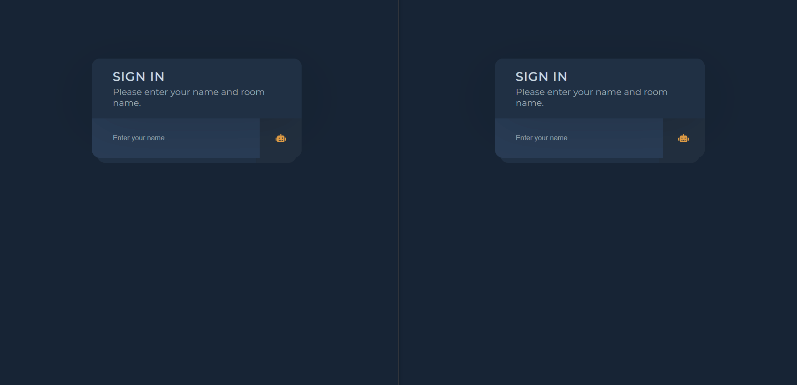

# ChatApp

This app was created using React, Socket.io and node.js.



### Installation

Open client and server directories separately in terminals, install dependencies and start both apps.

```sh
// server
cd server
npm install 
npm start

// client
cd client
npm install 
npm start
```
